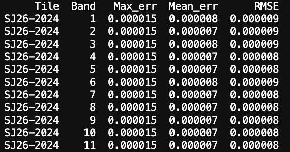

# Google Satellite Embedding per small area (2017-2024) data product
This technical report aims to describe the access, processing and development of the Imago Embedding data product, which is based on [AlphaEarth Foundations Satellite Embedding Dataset V1](https://developers.google.com/earth-engine/datasets/catalog/GOOGLE_SATELLITE_EMBEDDING_V1_ANNUAL) available in Google Earth Engine for 2017-2024.

This data product provides Embedding values (64-dimensional, L2-normalised vectors, with values ranging between −1 and +1) across the original dimensions, aggregated to small-area geographies — Lower Layer Super Output Areas (LSOAs). The source data has been accessed and processed at 10-metre spatial resolution from the annual products. Aggregation was carried out using a geospatial workflow that exported the tiled embedding data to Google Cloud Storage and then aggregated them to 2021 LSOA boundaries within each LSOA.

> Although 2017 featured data quality issues (see [here](https://source.coop/tge-labs/aef)), they have been addressed in the latest version of the > original Embedding data collection available on Google Earth Engine.
> *From the AI for Good-2026 Workshop:* The issue was related to dropout of some Sentinel-1 images, but the overall impact on dataset accuracy was quite > low. As a rule of thumb, **Google Earth Engine data is always a source of truth** and always contains the latest and updated version. 

For further details on the original Embedding dataset, see [this blogpost](https://medium.com/google-earth/ai-powered-pixels-introducing-googles-satellite-embedding-dataset-31744c1f4650).

The developed workflow involves two pipelines:

1. The export pipeline uses Google Earth Engine (GEE) and Google Cloud Storage configured with the professional paid project. Initial tests were conducted using a non-commercial GEE account with Google Drive.

2. Aggregation of embeddings at the level of small geographies (Lower Layer Super Output Areas (LSOAs) for England and Wales, Data Zones for Scotland, and Small Areas for Northern Ireland).

***

### Data specification

Throughout the IMAGO workflow, data changes its form twice, resulting in three data stages:
**0. Input data:**
- GeoTIFF format, optionally with COG layout (cannot be parameterised).
- 64 bands (from A00 to A63).
- Int16 data type, LZW compression.
- CRS - local UTM zone projection; spatial resolution 10 m.
- NoData is undefined by default (can be defined).
- Usually features one extra pixel along northern and eastern tile edges (so if expected 2000 x 2000 pixels, the output will contain 2001 x 2001 pixels).

**1. Intermediate data:**
- GeOTIFF format without COG layout.
- 64 bands (from A00 to A63).
- Int16 data type, LZW compression.
- CRS - EPSG:27700, OSGB36/British National Grid; spatial resolution 10 m.
- NoData is undefined with one extra pixel along the northern and eastern tile edges. In the further processing pixels equal to 0 are filtered out to avoid calculation distortions.
- Gridded by 20 x 20 km National Grid tiles.
- Value magnitude ranges from -32767 to +32767 to reduce the output size in average by one third of the original size. To work with original decimal values (to 'descale') which range from -1 to +1, the following formula can be used: $x_\text{original} = \frac{x_\text{int16}}{32767}$
- The scaled `int16` dataset preserves the original `float64` values with very high precision (*Figure 1*). The mean error and RMSE are on the 6th decimal place, while the maximum absolute error occurs at the 5th decimal place (validated for SJ26 tile, 2024).

  

    
  *Figure 1: Scaling error statistics snippet (IMAGO) for maximum error, mean error and MSE (above) and difference between the nonscaled and scaled values, A00 dimension, 2024, Tile SJ26 (below)* 

  Google Embedding dataset by [Source Cooperative](https://source.coop/tge-labs/aef) organised in a different way. It is stored in signed 8-bit data type through nonlinear scaling, with `-128` as a nodata value and the spatial index recorded within the filenames. This also allows to considerably reduce the filesize (3.45 GB for 8192 x 8192 pixel image), but has a lower accuracy, especially regarding the maximum error (*Figure 2*).

    
  *Figure 2: Scaling error statistics snippet (Source Cooperative) for maximum error, mean error and MSE*

2. **Output data:**
- GeoPackage format.
- Built on the [LSOA features](https://data.imago.ac.uk/datasets/lsoa-boundaries-for-the-united-kingdom-2021).
- Includes additional 64 columns for each statistical parameter (mean, median, min, max, std, sum, count), which represent Embedding values for each dimension.
- Magnitude of embedding value ranges from -1 to +1 (accordingly to input data).
- Embedding columns have floating-point (double-precision) data types, except from count (integer).

***

## **1. Google Earth Engine pipeline**

A command line tool to access annual satellite collections, filter by the area and timeframe of interest, and export in GeoTIFF format to Google Drive or Google Cloud Storage has been developed.

Main requirements are:

- Google Earth Engine account and created project (works for projects of any level)
- Area of interest, which can be tiled (for example, the UK gridded by tiles of 20km x 20 km)
- Year of interest

The pipeline utilises a simple processing and I/O structure by accesssing data from Google Earth Engine, checking its match with the area and timeframe of interest, and exporting imagery batches through Google Earth Engine API (*Figure 3*).

  
*Figure 3: Conceptual flowchart, illustrating the input data, input/output operations, processing steps and output data in the Google Earth Engine download pipeline*

**Any annual collections** can be used as input for further export, for example, [ESA WorldCover 10m v100](https://developers.google.com/earth-engine/datasets/catalog/ESA_WorldCover_v100) or [ESA WorldCereal Active Cropland 10 m v100](https://developers.google.com/earth-engine/datasets/catalog/ESA_WorldCereal_2021_MARKERS_v100). Dataset with higher granularity will not be correctly aggregated by this tool.

To test the tool and explore outputs it can be recommended to consider **the Greater London case study area**, which interesects 11 tiles of 20km x 20 km (according to the used LSOA polygons and [London Datastore](https://data.london.gov.uk/dataset/statistical-gis-boundary-files-for-london-20od9/)). However, almost 98% of the Greater London area is covered by six tiles: TQ06, TQ08, TQ26, TQ28, TQ46, TQ48. This area has been used to demonstrate the data product in the [hands-on workshop](https://imago-sdruk.github.io/EMBED2Social-Workshop-2026/Materials.html) introducing satellite (geo-)embeddings and their practical applications, co-organised by Imago and MHCLG.

### Command-line tool (CLI)

To run the tool in default mode, use: 
`python src/download_ee.py`

Additional help and usage examples can be explored by: `python src/download_ee.py --help`

Positional arguments are not used, as input names are long and non-obvious without a name. Therefore, the CLI tool uses `option` only.

The following options are provided:

| Option            | Description                                                      | Default                                |
| ----------------- | ---------------------------------------------------------------- | -------------------------------------- |
| `--collection`    | Earth Engine image collection to extract                         | GOOGLE/SATELLITE_EMBEDDING/V1/ANNUAL |
| `--project`, `-p` | Google Earth Engine project ID                                   | imago                                |
| `--auth-mode`     | Earth Engine authentication mode                                 | gcloud                               |
| `--tiles`         | Path to the gridded area of interest (tiles)                     | data/uk_1km_grid_sample1.gpkg        |
| `--storage`       | Export destination – either Google Cloud Storage or Google Drive | cloud                                |
| `--folder`        | Cloud Storage bucket or Google Drive folder                      | embed2social-storage                 |
| `--year`, `-y`    | Year to extract dataset for                                      | 2024                                 |
| `--verbose`, `-v` | Enable verbose logging (WARNING: can produce very large logs)    | False                               |
| `--cog`           | Export as Cloud Optimized GeoTIFF (COG)                          | False                                |
| `--crs`           | Coordinate Reference System (CRS) of the output                  | EPSG:27700                           |
| `--res`           | Spatial resolution of output                                     | 10                                   |
| `--scale`         | Scale to Int16, multiplying by 32767                             | False                                |

### Tiling 

Imago intermediate dataset in GeoTIFF format is gridded by 20 x 20 km British National Grid tiles, which accounts to 858 tiles in total for the UK.

Aside from original Google Satellite Embedding, there exist a Source Cooperative data product. AlphaEarth Foundation Embeddings in this product are internally tiled - the boundaries of tiles can be found [here](https://source.coop/tge-labs/aef/v1/annual/aef_index.gpkg) in `aef.index` file (incl. GeoPackage). UK is covered by 39 Embedding tiles in the original dataset, which generally follow the outlines of UTM zones.

However, testing with GEE export in verbose mode revealed that the original Embedding tiling differs from the published Source Cooperative tile boundaries. For example, the area of interest which intersects four Source Cooperative tiles, overlays only two original Google Satellite Embedding images while the outputs consistent and covers the whole area of interest. 

### Performance
There exist different time concepts when talking about cloud computing.

1. Python **pipeline runtime** (client wall-clock time)
It's time on client machine between two Python timestamps, so it doesn't indicate billing/quotas.
2. **EECU (Earth Engine Compute Units)** 
Computes consumption across all parallel workers (depends on CPU/memory) and shows billing/quotas.
Includes I/O reads, arrays manipulations, but doesn't include latency/queue scheduling/client waiting/Google Drive or Cloud uploads.
3. Task runtime
Includes queue wait time, server execution time, writing I/O (doesn't include time before scheduling a task)

Python runtime is a sum of task runtimes, client-side preparation, initialization and scheduling time before tasks start to run on Earth Engine.

Even the same requests might be processed in a very different time (see [here](https://developers.google.com/earth-engine/guides/computation_overview#stability_and_predictability)). It has been found that EECU time for the same area of interest can vary by a factor of 2.8, while total runtime can vary by up to a factor of 8.8. However, the pipeline runtime and billable EECU time can be roughly predicted for large extracts (see below).

**Pipeline runtime and data volume**

By tiling, compressing, and scaling the embedding data, the total data size was reduced from an estimated ~4 TiB to approximately 2 TiB.

| Year    | Pipeline runtime (s) | Pipeline runtime (h) | EECU time (s)    | EECU time (h)  | Total size (Gb) |
|:--------|:--------------------|:--------------------|:----------------|:---------------|:----------------|
| 2024    | 27,420.6247         | 7.6168              | 278,886.6827    | 77.4685        |   258.24              |
| 2023    | 30,263.8161         | 8.4066              | 264,226.6384    | 73.3962        |   258.64              |
| 2022    | 25,515.9630         | 7.0877              | 257,439.4404    | 71.5109        |   258.64              |
| 2021    | 27,541.3252         | 7.6504              | 262,592.8037    | 72.9424        |   258.48              |
| 2020    | 24,354.6962         | 6.7652              | 275,837.1997    | 76.6214        |   258.76              |
| 2019    | 41,363.0000         | 11.489              | 302,880.4143    | 84.1334        |   258.11              |
| 2018    | 32,771.5112         | 9.1032              | 262,321.2517    | 72.867         |   258.44              |
| 2017    | 42,716.2087         | 11.8656             | 287,451.6494    | 79.8477        |   260.33              |
|         |                     |                     |                 |                |     
| **AVERAGE** | 31,493.3931     | 8.7482              | 273,954.51      | 76.0985        |   258.705             |
| **TOTAL**   | 251,947.145     | **69.9853**             | 2,191 636.08    | **608.7877**       |   **2.02 TiB**              |

> #### **Batch export**
>
> In this pipeline, [batch export tasks](https://developers.google.com/earth-engine/apidocs/export-image-tocloudstorage) are used: `Export.image.toDrive` or `Export.image.toCloudStorage` which provide identical outputs:
>
> - The main parameters of these functions are the same
> - Only two formats available: GeoTIFF and TFR (tensorflowrecords): https://towardsdatascience.com/tfrecords-explained-24b8f2133282/ - serialized JSONs to binary sequences
> - LZW compression always applied to TIF, regardless whether it's COG or not
> - `maxPixels` parameter is crucial - if exceeded, raises Error
> - `shardSize` doesn't change metadata, but might contribute to higher EECU usage (for 101*101 pixel image shardsize=55 increases EECU time roughly by factor of 2). It's a sort of internal tiling, which can be used to reduce memory per worker and avoid errors (safer not means faster). Introduces overhead for small exports though.
>
> **Execution caveats**:
> - The number of concurrently running tasks vary depending on the project configuration. For the non-commercial project, it's up to three-four, for the professional paid project - 20.  
> - Maximum number of concurrently running tasks is not guaranteed (eg, for non-commercial projects one-task cap has been experienced).
> - It is not possible to exactly predict computation performance, as computational capacity is volatile and depends on caching/EE algorithm changes/libraries changes, aside from different underlying data.
> - Number of workers is determined by EE service configuration/ability to parallelise the job, and is **NOT CONFIGURABLE**.

***

## **2. LSOA aggregation**

*Figure X: Conceptual flowchart, illustrating the input data, input/output operations, processing steps and output data in the LSOA aggregation pipeline*

### Performance

...

***

## **Data product validation**

...

