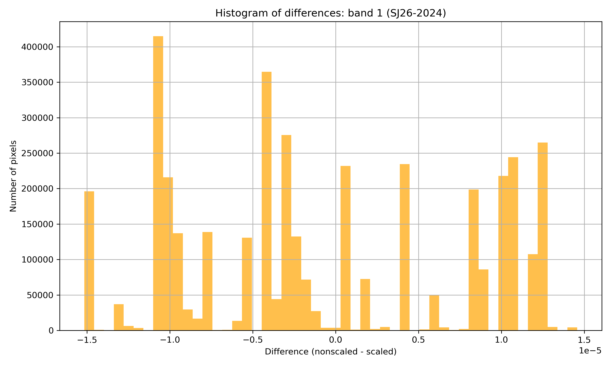
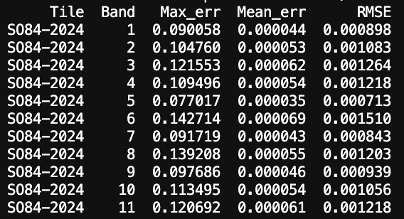

## Embeddings in spatial analysis
This technical document aims to describe the access and implementation of the [AlphaEarth Foundations Satellite Embedding Dataset](https://developers.google.com/earth-engine/datasets/catalog/GOOGLE_SATELLITE_EMBEDDING_V1_ANNUAL) for social science. This annual dataset is available in Google Earth Engine for 2017-2024, although 2017 features data quality issues (see [here](https://source.coop/tge-labs/aef)), as of 13/01/2026. 

*From the AI for Good-2026 workshop:* The issue was related to dropout of some Sentinel-1 images, but the overall impact on dataset accuracy was quite low. Now, fixed data for 2017 is available on Google Earth Engine. As a rule of thumb, **Embeddings on Google Earth Engine data is always a source of truth**, always contains the latest and updated version. 

For further details on the Embedding dataset, see [this blogpost](https://medium.com/google-earth/ai-powered-pixels-introducing-googles-satellite-embedding-dataset-31744c1f4650).

The provided export pipeline uses Google Earth Engine and Google Cloud Space storage configured with the profeessional paid proejct. The initial test were conducted using the non-commercial Google Earth Engine account with Google Drive.

### Data specification
**Input data:**
- 64 bands (from A00 to A63)
- COG layout (optional)
- LZW compression (regardless whether COG or not)
- NoData is undefined by default (can be defined)
- usually one extra pixel along northern and eastern tile edges (so if expected 2000 x 2000 pixels, the output will contain 2001 x 2001 pixels)

**Output data:**
- 64 bands (from A00 to A63)
- Int16 data type
- GeoTIFF format without COG
- LZW compression
- 10 m spatial resolution
- Tiled by 20 x 20 km National Grid (2001 x 2001 px)
- NoData is undefined with one extra pixel along the northern and eastern tile edges. At the same time, for further processing pixels equal to 0 should be filtered out as they distort the calculation.
- Value magnitude ranges from -32767 to +32767 to reduce the output size in average by one third of the original size. To work with original decimal values (to 'descale') which range from -1 to +1, use the following formula:

$x_\text{original} = \frac{x_\text{int16}}{32767}$

- The scaled int16 dataset preserves the original float64 values with very high precision. The mean error and RMSE are on the 6th decimal place, while the maximum absolute error occurs at the 5th decimal place (validated for SJ26 tile, 2024).

**Scaling error statistics snippet (IMAGO)**  

Google Embedding dataset by [Source Cooperative](https://source.coop/tge-labs/aef) organised in a different way. It is stored in signed 8-bit data type through nonlinear scaling, with `-128` as a nodata value and the spatial index recorded within the filenames. This also allows to considerably reduce the filesize (3.45 GB for 8192 x 8192 pixels), but has a lower accuracy, especially regarding the maximum error.

**Scaling error statistics snippet (Source Cooperative)**  

### Tiling (AlphaEarth Foundations and Source Cooperative)
AlphaEarth Foundation Embeddings in the Source Cooperative data product are internally tiled - the boundaries of tiles can be found [here](https://source.coop/tge-labs/aef/v1/annual/aef_index.gpkg) in `aef.index` file (incl. GeoPackage).

However, when running export directly through GEE in a verbose mode, it turned out that the original Embedding tiling is different from the published tile boundaries (eg, area of interest which intersects four Embedding tile, filters only two images while the outpus consistent and covers the whole area of interest). 

**TODO** - to insert visualisation of different tile systems

Therefore, the UK is covered by 39 Embedding tiles in the original dataset, which generally follow the outlines of UTM zones.

### Time concepts
There exist different time concepts when talking about cloud computing.

1. Python **pipeline runtime** (client wall-clock time)
It's time on client machine betweeb two Python timestamps, so it doesn't indicate billing/quotas.
2. **EECU (Earth Engine Compute Units)** 
Computes consumption across all parallel workers (depends on CPU/memory) and shows billing/quotas.
Includes I/O reads, arrays manipulations, but doesn't include latency/queue scheduling/client waiting/Google Drive or Cloud uploads.
3. Task runtime
Includes queue wait time, server execution time, writing I/O (doesn't include time before scheduling a task)

Python runtime is a sum of task runtimes, client-side preparation, initialization and scheduling time before tasks start to run on Earth Engine.

Even the same requests might be processed in a very different time (see [here](https://developers.google.com/earth-engine/guides/computation_overview#stability_and_predictability)). It has been found that EECU time for the same area of interest can vary by a factor of 2.8, while total runtime can vary by up to a factor of 8.8.

**Time performance and data size by year**

| Year | Pipeline runtime (s) | Pipeline runtime (h) | EECU time (s) | EECU time (h) | Total size (Gb) |
|:-----|---------------------:|---------------------:|--------------:|--------------:|---------------:|
| 2024 | 27,420.62465         | 7.61684018           | 278,886.6827  | 77.46852297   |     |
| 2023 |         |           |   |   |          |
| 2022 |         |           |   |   |          |
| 2021 |         |           |   |   |          |
| 2020 |         |           |   |   |          |

### London case study

The Greater London interesects 11 tiles of 20km x 20 km (according to [London Datastore](https://data.london.gov.uk/dataset/statistical-gis-boundary-files-for-london-20od9/)). However, almost 98% of the Greater London area is covered by six tiles:

TQ06, TQ08, TQ26, TQ28, TQ46, TQ48.

### Google Cloud useful links
Projects: https://console.cloud.google.com/earth-engine/welcome?project=embed2social

See your quota: https://docs.cloud.google.com/iam/docs/roles-permissions/servicemanagement#servicemanagement.quotaViewer

Check quotas: https://console.cloud.google.com/iam-admin/quotas

Additionally, check your pricing [here](https://cloud.google.com/earth-engine/pricing)!

See the catalogue: https://developers.google.com/earth-engine/datasets/catalog

Check all tasks: https://console.cloud.google.com/earth-engine/tasks?project=embed2social

Your buckets (browser): https://console.cloud.google.com/storage/browser/embed2social-storage/

See the traffic and latency: https://console.cloud.google.com/apis/dashboard?project=embed2social (if performance is lower than expected)

Benchmarking: https://github.com/google/earthengine-community/blob/master/guides/linked/Earth_Engine_benchmarking_toolkit.ipynb

### GEE code features
Code consists of:
-client (Python objects)
-server (`ee`. handler)
-proxy objects - containerised Python objects transformed into `ee.computedObject`

FeatureCollection -> Feature (watershed)
ImageCollection -> Image (satellite)

Processing environments:
- `interactive`
-- `standard endpoint` (low volume of concurrent, non-programmatic requests)
-- `high-volume endpoint` (more latency, less caching, simple, automated, small queries)
-`batch`:
* asyncronous or offline stac
* high-latency parallel processing
* maximum number of batch tasks is determined by pricing or maybe adjusted (see [concurrent batch export tasks](https://cloud.google.com/earth-engine/pricing#enterprise)).

### Batch export

Export tasks are classified as batch processing (for example, [cloud export](https://developers.google.com/earth-engine/apidocs/export-image-tocloudstorage)).

`Export.image.toDrive` or `Export.image.toCloudStorage`:
- the main parameters of these functions are the same
- only two formats available: GeoTIFF and TFR (tensorflowrecords): https://towardsdatascience.com/tfrecords-explained-24b8f2133282/ - serialized JSONs to binary sequences
- LZW always applied to TIF, regardless whether it's COG or not
- `maxPixels` parameter is important - if exceeded, raises Error
- `shardSize` doesn't change metadata, but might contribute to higher EECU usage (for 101*101 pixel image shardsize=55 increases EECU time roughly by factor of 2).  It's a sort of internal tiling, which can be used to reduce memory per worker and avoid errors (safer not means faster). Introduces overhead for small exports though.

**Notes:**
- the number of concurrently running tasks vary depending on the project configuration. For the non-commercial project, it's up to three-four, for the professional paid project - 20.
- we can't exactly predict computation performance, it's volatile and depends on caching/EE algorithm changes/libraries changes, aside from different underlying data
- number of workers is determined by EE service configuration/ability to parallelise the job, **NOT CONFIGURABLE**.
- in a research mode, tasks are scheduled independently for each individual, but visible across the project. In a paid mode, tasks are organised in a project-wide queue
- it is not possible to set task priorities for users with non-commercial access
- it's impossible to run GEE completely lasily, without hitting real data, to check the performance/tasks/operations/memory/computation graph. Possible to use `explain` on collections/images to inspect the computation graph.

### GEE processing structure
- One task = one operation
- Operation = stage + stage + stage + ... Stages ≈ phases of the operation (map → reduce → output).
Operation examples: "create local files", "write files to destiantion".
- Stage = work unit + work unit + .... Work units ≈ smallest chunk of computation (tile).
- Workers ≈ processes that handle work units

In the non-commercial version tasks are scheduled quickly, one by one, but it's usually up to only three tasks concurrently `running on the backend`, while the rest is just `submitted on the backend`. This timeframe when tasks are submitted to the backend servers but do not run yet, contribute to the queue time but not to EECU time.

#### Code recommendations:
- avoid `for` loops in server code, use instead **mapping with lambda**
- avoid `if/else`, use server-side conditional
- use `ee.Thing` as a server object and `ee.Thing.method()` as a server function
- create Python base, then wrap it with GEE

#### TODOs 
- ~~avoid pasting tokens each time for a new EE request~~ - DONE
- ~~to read time of GEE concurrent tasks once all tasks completed~~ - DONE
- ~~to find out if LZW applied automatically~~ - DONE
- ~~find out the approximate EECU consumption per one 20km x 20km tile per one year~~ - DONE
- ~~in Drive, to create a folder before exporting datasets~~ - NOT NEEDED ANYMORE
- ~~in Google Drive, handle overwriting files~~ - NOT NEEDED ANYMORE
- ~~to test splitting one big tile (20km) into multiple chunks and feed them as separate tasks into GEE (currently each tile is one task)~~ - NOT NEEDED ANYMORE
- ~~to check if additional reprojecting in building a cell involves more EECU (maybe a bit, but not so relevant)~~ - DONE
- ~~to check if mosaicked datasets involve more EECU (no visible diffrences)~~ - DONE
- ~~to find out the real boundaries of Google Embeddings~~ - DONE
- ~~to analyse the accuracy of the Source Cooperative dataset~~ - DONE
- ~~to compress the dataset size:~~
    - ~~converting  values to integer through a scale factor~~ - DONE
    - ~~output will be in int32 or int16 (preferably unsigned)~~ - DONE
    - ~~to decide whether COG is required and what is the best combination for compression/format/COG~~ - DONE

