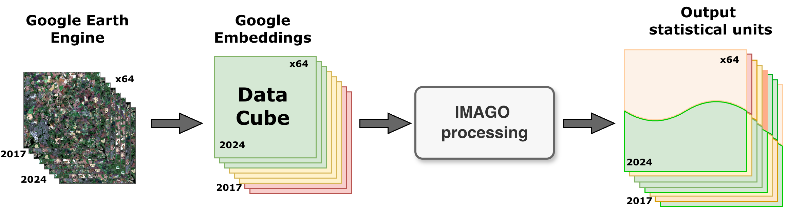
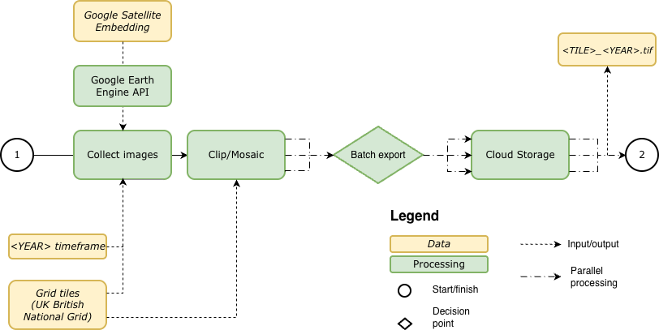
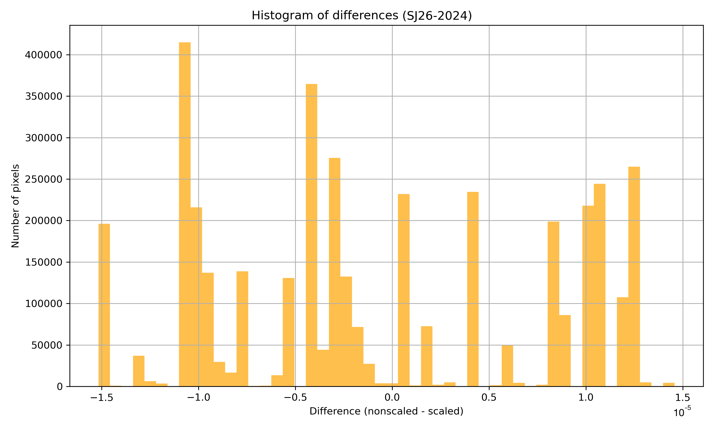
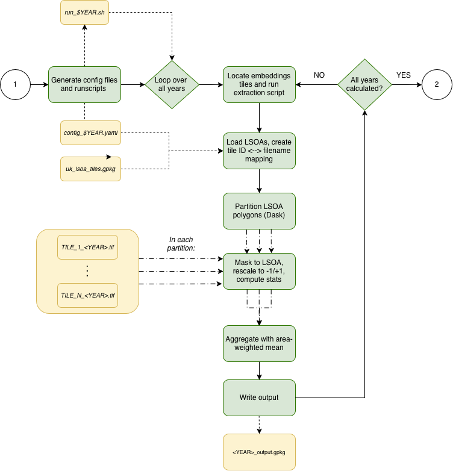
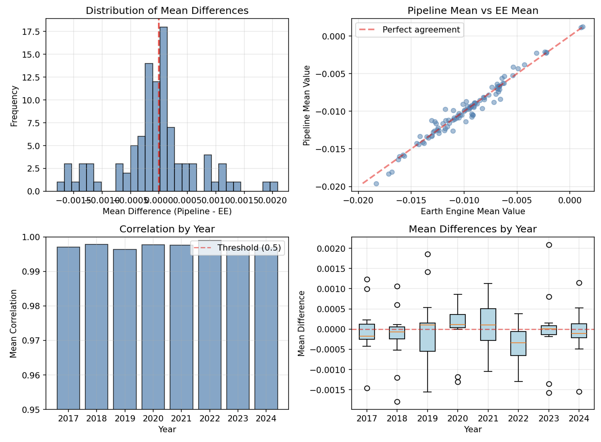

# Google Satellite Embedding V1 - small areas (2017-2024)

## Abstract

This report describes the development, methodology, and validation of the Imago Embedding data product — a UK-wide dataset of satellite-derived embedding vectors aggregated to Lower Layer Super Output Area (LSOA) geographies for the years 2017–2024. The data product is derived from the [AlphaEarth Foundations Satellite Embedding Dataset V1](https://developers.google.com/earth-engine/datasets/catalog/GOOGLE_SATELLITE_EMBEDDING_V1_ANNUAL). The workflow consists of two automated pipelines: a Google Earth Engine export pipeline that retrieves and tiles 64-dimensional GeoTIFF datasets across British National Grid tiles, and aggregation pipeline that computes mean embedding vectors for each of the small statistical areas in the UK. The resulting GeoPackage output provides 64-dimensional embedding vectors (range [−1, 1]) for each LSOA and year. Validation confirms 100% range compliance across ~24 million values and near-perfect correlation (mean r = 0.997) without systematic bias . The data product is published via the [Imago Data Catalogue](https://data.imago.ac.uk/datasets/google-satellite-embedding-v1-small-areas-2017-2024) and is intended to support small-area analysis, spatial planning, and policy applications.

## Keywords

Housing and Property; Health and Wellbeing; Sustainability; google-embeddings; LSOA; UK

---

## 1. Introduction

### 1.1 Background

Satellite-derived embeddings represent a new approach in geospatial science, encoding complex spectral and spatial patterns from Earth observation imagery into compact, high-dimensional feature vectors. The [AlphaEarth Foundations Satellite Embedding Dataset V1](https://developers.google.com/earth-engine/datasets/catalog/GOOGLE_SATELLITE_EMBEDDING_V1_ANNUAL), produced by Google and available on Google Earth Engine, provides 64-dimensional, L2-normalised embedding vectors at 10-metre spatial resolution derived from annual satellite composites for 2017-2024. These embeddings capture rich environmental and structural information latent in satellite imagery, providing a foundation for a wide range of downstream analytical tasks.

However, direct use of pixel-level embedding data at national scale is computationally heavy for most research and policy applications. This data product aims to aggregate these embeddings at established administrative geographies, such as LSOAs in England and Wales, which makes them more usable for social science, urban analysis, and policy research.

*[PENDING - mention equivalent geographies in Scotland/NE]*

### 1.2 Motivation

Lower Layer Super Output Areas (LSOAs) are the standard small-area geographic unit used across UK government statistics, including the Index of Multiple Deprivation, Census data and a broad range of health, housing, and economic indicators. Although there is a clear potential of satellite embeddings for characterising local environments, there is no publicly available product which aggregated such data to LSOA level for the full UK and the full 2017–2024 temporal range prior to this work.

> Although 2017 featured data quality issues (see [here](https://source.coop/tge-labs/aef)), they have been addressed in the latest version of the original Embedding data collection available on Google Earth Engine. The issue was related to dropout of some Sentinel-1 images, but the overall impact on dataset accuracy was quite low. As a rule of thumb, **Google Earth Engine data is always a source of truth** and always contains the latest and updated version.

>*[THIS PART can be skipped or put into the appendix?]*

### 1.3 Objectives

This data product and the accompanying technical report have the following objectives:

- To develop a reproducible, automated pipeline for extracting and processing annual satellite embedding data from Google Earth Engine at UK national scale.
- To aggregate pixel-level embedding vectors to small-area boundaries using a tile-aware weighted averaging procedure.
- To validate the resulting data product against direct Earth Engine extraction and confirm compliance with the theoretical embedding data value range.
- To publish the validated dataset via the Imago Data Catalogue in an accessible, well-documented format for use by researchers and policy professionals.

### 1.4 Contributions

The principal contributions of this work are:

- A command-line tool for batch export of annual Google Earth Engine image collections to tiled GeoTIFF format.
- An LSOA aggregation pipeline implementing pixel-weighted, multi-tile averaging, scalable to other geographic units.
- A validated, publication-ready GeoPackage data product providing 64-dimensional embedding vectors for 46,844 LSOAs annually from 2017 to 2024.
- A quantitative validation framework comparing pipeline outputs against direct Earth Engine extraction.

For further details on the original Embedding dataset, see [this blogpost](https://medium.com/google-earth/ai-powered-pixels-introducing-googles-satellite-embedding-dataset-31744c1f4650).

---

## 2. Source Data and Study Area

### 2.1 Original Google Satellite Embedding Dataset

The source data for this product is the [AlphaEarth Foundations Satellite Embedding Dataset V1](https://developers.google.com/earth-engine/datasets/catalog/GOOGLE_SATELLITE_EMBEDDING_V1_ANNUAL), available on Google Earth Engine. This dataset provides annual 64-band raster imagery representing L2-normalised embedding vectors at 10-metre spatial resolution, with values bounded within [−1, 1]. The collection spans 2017 to 2024.

An alternative distribution of the same underlying embeddings is available via [Source Cooperative](https://source.coop/tge-labs/aef). In that product, AlphaEarth Foundation Embeddings are stored in signed 8-bit data type through nonlinear scaling, with `−128` as the nodata value and the spatial index recorded within the filenames. While this reduces file size (3.45 GB for an 8192 × 8192 pixel image), it has lower precision, particularly regarding maximum error (see Section 3.4 and Appendix E).

Importantly, testing with GEE export in verbose mode revealed that the original Embedding tiling differs from the published Source Cooperative tile boundaries. For example, an area of interest intersecting four Source Cooperative tiles may overlay only two original Google Satellite Embedding images, while the output remains consistent and covers the entire area of interest. **Google Earth Engine data is always the authoritative source of truth** and always contains the latest updated version.

*[THIS PART CAN BE MOVED INTO APPENDICES?]*

### 2.2 Geographic Coverage and Aggregation Units

The target geographic unit for aggregation is the Lower Layer Super Output Area (LSOA), the standard small-area statistical geography for England and Wales, with equivalent units for Scotland and Northern Ireland. The dataset covers the full UK, comprising 46,844 LSOAs per year, based on 2021 LSOA boundaries available from the [Imago Data Catalogue](https://data.imago.ac.uk/datasets/lsoa-boundaries-for-the-united-kingdom-2021).

To test the tool and explore outputs, it is recommended to explore the educational Embedding product, covering the Greater London Area in the [Imago Data Catalogue](https://data.imago.ac.uk/datasets/google-satellite-embedding-v1-london-lsoas-2020-2024).

### 2.3 Input Data Specifications

The input data as received from Google Earth Engine has the following characteristics:

- **Format:** GeoTIFF, optionally with COG (Cloud-Optimised GeoTIFF) layout.
- **Bands:** 64 bands, labelled A00 to A63.
- **Data type:** Int16, LZW compression.
- **CRS:** Local UTM zone projection; spatial resolution 10 m.
- **NoData:** Undefined by default (can be defined).
- **Tile edge artefact:** Usually features one extra pixel along northern and eastern tile edges (e.g., expected 2000 × 2000 pixels yields 2001 × 2001 pixels in output).

---

## 3. Methodology

### 3.1 Workflow Overview

The IMAGO processing workflow consists of two sequential automated pipelines (*Figure 1*):

1. **Google Earth Engine Export Pipeline** — accesses annual satellite embedding collections on GEE, filters by area and year, and exports tiled GeoTIFF imagery to Google Cloud Storage or Google Drive.
2. **LSOA Aggregation Pipeline** — takes the tiled GeoTIFF outputs, reprojects to the British National Grid, and computes pixel-weighted mean embedding vectors for each LSOA.

Throughout the workflow, data changes form twice, passing through three distinct stages: input data (raw GEE export), intermediate data (reprojected, scaled GeoTIFFs), and output data (LSOA-level GeoPackage). These stages are described in Sections 3.4–3.5 and Section 4.

 <br>
*Figure 1: Conceptual flowchart illustrating the main processing steps*

### 3.2 Google Earth Engine Export Pipeline

A command-line tool has been developed to access annual satellite collections on Google Earth Engine, filter by the area and timeframe of interest, and export in GeoTIFF format to Google Drive or Google Cloud Storage.

Main requirements are:

- Area of interest, which can be tiled (for example, the UK gridded by tiles of 20 × 20 km)
- Year of interest

The pipeline utilises a simple processing and I/O structure by accessing data from Google Earth Engine, checking its match with the area and timeframe of interest, and exporting imagery batches through the Google Earth Engine API (*Figure 2*).

 <br>
*Figure 2: Conceptual flowchart illustrating the input data, input/output operations, processing steps and output data in the Google Earth Engine download pipeline*

In this pipeline, [batch export tasks](https://developers.google.com/earth-engine/apidocs/export-image-tocloudstorage) are used — `Export.image.toDrive` or `Export.image.toCloudStorage` — which produce identical outputs. 

Full CLI usage is documented in Appendix A.

### 3.3 Tiling Strategy (20 × 20 km British National Grid)

The Imago intermediate dataset in GeoTIFF format is gridded by 20 × 20 km British National Grid (BNG) tiles, totalling 858 tiles for the full UK coverage. This tiling structure aligns with the OSGB36/British National Grid (EPSG:27700) coordinate reference system used throughout the intermediate processing stage.

The UK is covered by 39 Embedding tiles in the original Google Satellite Embedding dataset, which generally follow the outlines of UTM zones. Another data provider, Source Cooperative, provides different [tiling structure](https://source.coop/tge-labs/aef/v1/annual/aef_index.gpkg). However, as noted in Section 2.1, the original GEE Embedding tiling differs from the Source Cooperative tile boundaries, so GEE export is always used as the authoritative source.

### 3.4 Embedding Transformation and Scaling (Int16 Scaling)

To reduce storage requirements while preserving precision, the pipeline optionally scales the native `float64` embedding values (range [−1, +1]) to `Int16` representation (range [−32767, +32767]), reducing output size by approximately one third.

To recover original decimal values (to "descale"), apply:

$$x_\text{original} = \frac{x_\text{int16}}{32767}$$

The scaled `Int16` dataset preserves the original `float64` values with very high precision (*Figure 3*). The mean error and RMSE are on the 6th decimal place, while the maximum absolute error occurs at the 5th decimal place (validated for tile SJ26, 2024). Full scaling precision statistics are provided in Appendix E.

 <br>
*Figure 3: distribution of differences between non-scaled and scaled values, A00 dimension, 2024, Tile SJ26 (below)*

By contrast, the Source Cooperative distribution uses signed 8-bit encoding, which allows a smaller file size but introduces higher maximum errors (see Appendix E).

### 3.5 Intermediate Data Specifications

After reprojection and scaling, the intermediate data has the following characteristics:

- **Format:** GeoTIFF (without COG layout).
- **Bands:** 64 bands, labelled A00 to A63.
- **Data type:** Int16, LZW compression.
- **CRS:** EPSG:27700, OSGB36/British National Grid; spatial resolution 10 m.
- **NoData:** Undefined, with one extra pixel along the northern and eastern tile edges. Pixels equal to 0 are filtered out during further processing to avoid calculation distortions.
- **Tiling:** Gridded by 20 × 20 km National Grid tiles.
- **Value range:** −32767 to +32767 (scaled); equivalent to [−1, +1] in original float64 space.

### 3.6 LSOA Aggregation Pipeline

The LSOA aggregation pipeline takes the tiled GeoTIFF outputs from the GEE export step and aggregates them to LSOA boundaries. The output is a GeoPackage file with one row per LSOA, and columns for each of the 64 embedding dimensions representing the mean embedding value across all pixels falling within the LSOA boundary.

This step can be run for all years in the dataset using `bash` scripting and configuration file templates, which differ only in the year of interest.

The pipeline is controlled by a script `run_all_years.sh` (*Figure 4*, step 1). This script generates a configuration file (`config_$YEAR.yaml`) and a separate runscript (`run_$YEAR.sh`) for each year of interest (default 2017–2024) based on these templates. The configuration file contains all relevant parameters, including input/output paths, number of workers, and memory per worker. The runscript then runs the extraction pipeline for that year via `embed_to_lsoa.py`, using the generated configuration file as input.


*Figure 4: Conceptual flowchart illustrating the input data, input/output operations, processing steps and output data in the LSOA aggregation pipeline*

`embed_to_lsoa.py` calls routines from the `imago` toolkit repository to perform the LSOA calculation. It creates a mapping between tile IDs and filenames, loads the relevant tiles for each LSOA in the input GeoPackage, and uses `dask` to parallelise over LSOAs in chunks. Within each `dask` worker, `rasterio` performs zonal statistics to calculate the mean embedding value for each dimension across all pixels falling within the LSOA boundary.

Since the pipeline relies solely on an input GeoPackage file, it is possible to perform the same aggregation for other geographies (e.g., MSOA), provided these files contain an appropriate tile ↔ polygon mapping.

### 3.7 Weighted Averaging Procedure for Multi-Tile LSOAs

For LSOAs that span multiple tiles, a tile-aware weighted averaging procedure is applied:

1. The mean embedding value is calculated *per tile* for each LSOA-tile intersection.
2. The pixel count overlapping with each tile is saved alongside the per-tile mean.
3. The final LSOA embedding vector is computed as the weighted average of per-tile means, weighted by the number of overlapping pixels in each tile.

This ensures that the final average is representative of the entire LSOA, rather than being biased towards the tile with the greatest pixel overlap. This approach is necessary because some LSOAs, particularly in areas near tile boundaries, may cover two or more 20 × 20 km tiles.

The current implementation uses `rasterio` for zonal statistics, which is faster than libraries such as `exactextract` but treats all overlapping pixels as contributing equally (i.e., no partial-pixel weighting at LSOA boundaries). This introduces a small bias for small, high-density LSOAs; however, the 10-metre raster resolution substantially mitigates this effect (see Section 7.3 and the Validation section in Section 5).

### 3.8 Computational Infrastructure and Parallel Processing

**GEE Export Pipeline**

Processing is performed on Google Earth Engine infrastructure. Three distinct time concepts are relevant:

1. **Python pipeline runtime** (client wall-clock time) — time on the client machine between two Python timestamps. Does not reflect billing or quota consumption.
2. **EECU (Earth Engine Compute Units)** — compute consumption across all parallel workers; reflects billing and quotas. Includes I/O reads and array manipulations, but excludes latency, queue scheduling, client waiting, and Google Drive/Cloud upload time.
3. **Task runtime** — includes queue wait time, server execution time, and write I/O. Does not include client-side time before scheduling.

Python pipeline runtime is the sum of individual task runtimes plus client-side preparation, initialisation, and scheduling time. Even identical requests can be processed in very different times (see [GEE Computation Overview](https://developers.google.com/earth-engine/guides/computation_overview#stability_and_predictability)). EECU time for the same area of interest has been observed to vary by a factor of 2.8, while total runtime can vary by up to a factor of 8.8.

**LSOA Aggregation Pipeline**

The LSOA aggregation step is run on a virtual machine (VM) with 8 CPUs and 32 GB of memory, chosen as a balance between performance and cost. Data is accessed from Google Cloud Storage (GCS) via bucket mounting to the VM. This introduces I/O overhead compared to local disk access, but avoids the need to download the full dataset locally.

Key implementation choices for performance:

- **Chunked band processing:** Calculation is split into groups of bands (e.g., 8 bands per chunk, 8 chunks for 64 bands total), enabling processing without spilling to disk.
- **LRU caching:** `functools.lru_cache` is used to cache tile metadata from repeated `rasterio.open` calls, improving overall performance by approximately 25%.
- **Dask parallelism:** `dask` is used to parallelise over LSOAs in chunks, with 8 concurrent workers.

On average, the LSOA aggregation step takes approximately 1.5 hours per year, making it possible to process the full 2017–2024 dataset in a single day.

Full runtime benchmarking data is provided in Appendix B.

---

## 4. Data Product Description

### 4.1 Output Structure

The output data product is a GeoPackage (`.gpkg`) file with one row per LSOA per year. Each row contains the LSOA geometry (from [2021 LSOA boundaries](https://data.imago.ac.uk/datasets/lsoa-boundaries-for-the-united-kingdom-2021)) and 64 embedding columns per statistical parameter. The product covers 46,844 LSOAs annually from 2017 to 2024 (8 annual files).

### 4.2 Embedding Dimensions

Each LSOA row includes 64 embedding dimensions (band1_mean to band64_mean), each representing the mean embedding value across all pixels within the LSOA for that dimension and year. These are L2-normalised vectors derived from the AlphaEarth Foundation model, encoding spectral and structural information from annual satellite composites.

### 4.3 File Formats and Storage

The main output format is GeoPackage (`.gpkg`). By tiling, compressing, and scaling the embedding data during the GEE export step, total data volume was reduced from an estimated ~4 TiB (unscaled float64) to approximately **2.02 TiB** (Int16, LZW-compressed) across all 8 years.

### 4.4 Metadata and Attribute Schema

The output GeoPackage includes:

- LSOA identifier and geometry columns (from the 2021 LSOA boundary dataset).
- 64 embedding columns per statistical parameter. For the primary product, the aggregation statistic is the **mean** embedding value per dimension. Each embedding column uses a **floating-point (double-precision)** data type.

Additional statistical parameters (median, min, max, std, sum) are available and can be computed from the pipeline if required. Full field descriptions are provided in Appendix D.

---

## 5. Technical Validation

### 5.1 Validation Framework

Validation of the LSOA-level satellite embedding datasets was conducted through two primary checks:

1. **Range validation** — verifying that all embedding values fall within the theoretical [−1, 1] bounds.
2. **Random sampling validation** — comparing pipeline-generated LSOA mean values against values extracted directly from Google Earth Engine for a random sample of LSOA-year pairs.

| Validation Task | Description | Status |
| --- | --- | --- |
| Range Check | Verify all embedding values are within [−1, 1] | ✅ PASSED |
| Random Sampling Validation | Compare pipeline with EE extraction (100 samples) | ✅ PASSED |

### 5.2 Range Validation [−1, 1]

The AlphaEarth embedding model produces values theoretically bounded within [−1, 1]. This check systematically inspected every numeric value across all 64 embedding dimensions for each year from 2017 to 2024.

- Total values inspected per year: 46,844 LSOAs × 64 dimensions = 2,998,016 values
- Total values inspected across 8 years: ~24 million values

| Year | LSOAs | Dimensions | Total Values | Out-of-Range | Status |
| --- | --- | --- | --- | --- | --- |
| 2017 | 46,844 | 64 | 2,998,016 | 0 | ✅ |
| 2018 | 46,844 | 64 | 2,998,016 | 0 | ✅ |
| 2019 | 46,844 | 64 | 2,998,016 | 0 | ✅ |
| 2020 | 46,844 | 64 | 2,998,016 | 0 | ✅ |
| 2021 | 46,844 | 64 | 2,998,016 | 0 | ✅ |
| 2022 | 46,844 | 64 | 2,998,016 | 0 | ✅ |
| 2023 | 46,844 | 64 | 2,998,016 | 0 | ✅ |
| 2024 | 46,844 | 64 | 2,998,016 | 0 | ✅ |

100% compliance with the [−1, 1] range constraint across all years and all embedding dimensions has been confirmed. All ~24 million values are within the expected bounds.

### 5.3 Random Sampling Against Google Earth Engine

A random sample of 100 (LSOA, year) pairs was drawn from 400 available pairs (50 LSOAs × 8 years). For each sampled pair, the pipeline-generated mean embedding vector was compared against the mean embedding vector computed by direct extraction from Google Earth Engine.

- **Sample size:** 100 randomly selected (LSOA, year) pairs
- **Available pairs:** 400 total (50 LSOAs × 8 years); the 50 LSOAs are year-specific and not necessarily the same across years
- **Comparison metrics:** Mean difference, Pearson correlation, standard deviation of differences
- **Tolerance threshold:** ±0.1 for mean difference
- **Correlation threshold:** r > 0.5

### 5.4 Statistical Consistency and Correlation Assessment

| Metric | Value |
| --- | --- |
| Total comparisons completed | 100 |
| Unique LSOAs sampled | 42 |
| Years covered | 2017, 2018, 2019, 2020, 2021, 2022, 2023, 2024 |
| Mean difference (Pipeline − EE) | −0.000049 |
| Std deviation of differences | 0.000698 |
| Mean correlation | 0.9973 |
| Min correlation | 0.9859 |
| Max correlation | 1.0000 |

| Criterion | Threshold | Pass Rate |
| --- | --- | --- |
| Mean values within tolerance | ±0.1 | 100.0% |
| Correlation above threshold | r > 0.5 | 100.0% |

### 5.5 Systematic Bias Testing

| Test | Value | Result |
| --- | --- | --- |
| t-statistic | −0.7085 | |
| p-value | 0.4803 | ✅ PASS |
| Conclusion | | No systematic bias detected |

### 5.6 Temporal Consistency

The yearly breakdown of mean differences and standard deviations confirms stability across the full 2017–2024 period, with no evidence of temporal drift:

| Year | Count | Mean Difference | Std Deviation |
| --- | --- | --- | --- |
| 2017 | 11 | −0.000027 | 0.000713 |
| 2018 | 13 | −0.000176 | 0.000716 |
| 2019 | 13 | 0.000040 | 0.000887 |
| 2020 | 15 | 0.000082 | 0.000602 |
| 2021 | 10 | 0.000120 | 0.000648 |
| 2022 | 10 | −0.000426 | 0.000538 |
| 2023 | 15 | −0.000018 | 0.000821 |
| 2024 | 13 | −0.000062 | 0.000605 |

Mean differences remain tightly centred around zero across all years, with consistently negligible variation and no evidence of temporal drift.

### 5.7 Visual Validation

The figure 5 presents complementary visualisations confirming statistical consistency between pipeline-generated data and direct Earth Engine extraction.

 <br>

*Figure 5: Validation visualisations showing distribution of mean differences, correlation between pipeline and Earth Engine data, and yearly performance.*

**Top-Left Panel — Distribution of Mean Differences:** The distribution is tightly centred around zero with no visible skew, indicating neither dataset systematically overestimates or underestimates the other. All values cluster within ±0.002 — well inside the ±0.1 tolerance threshold.

**Top-Right Panel — Pipeline Mean vs. EE Mean:** Near-perfect alignment of points along the identity line demonstrates that pipeline values are almost identical to direct Earth Engine extraction across the full value range.

**Bottom-Left Panel — Correlation by Year:** Correlations consistently exceed 0.99 across all eight years (well above the 0.5 threshold), demonstrating stable data quality and extraction fidelity with no temporal degradation.

**Bottom-Right Panel — Mean Differences by Year:** Medians cluster tightly around zero with extremely narrow interquartile ranges, confirming no single year exhibits systematic bias.

**Combined Validation Summary:**

| Validation Criterion | Result
| --- | --- |
| Range check [−1, 1] | 100% compliant
| Statistical consistency with EE | 100% pass rate
| Systematic bias | None detected
| Year-to-year consistency | Stable across all years

---

## 6. Performance Evaluation

### 6.1 Runtime and Compute Performance

In GEE export pipeline, the total data size was reduced from an estimated ~4 TiB to approximately 2 TiB by tiling, compressing, and scaling the embedding data. Full runtime and EECU data are provided in Appendix B.

The LSOA aggregation step runs on a VM with 8 CPUs and 32 GB of memory, accessing data from Google Cloud Storage. On average, each year takes approximately **1.5 hours**, making the full 2017–2024 extraction achievable in a single day.

### 6.2 Storage Optimisation

The pipeline achieves significant storage reduction through three complementary strategies:

- **Tiling** (20 × 20 km BNG tiles), which enables parallel processing and avoids loading the full national dataset into memory.
- **Int16 scaling** (multiplying float64 values by 32,767), which reduces per-file size by approximately one third compared to float32 or float64 representation.
- **LZW compression**, applied automatically to all GeoTIFF outputs.

Together these reduce the total UK dataset from an estimated ~4 TiB (unscaled) to **~2.02 TiB** (8 years combined) (see Appendix E).

### 6.3 Scalability and Reproducibility

The pipeline is designed to be fully reproducible and extensible:

- The LSOA aggregation pipeline accepts any input GeoPackage with an appropriate tile ↔ polygon mapping, enabling aggregation to other geographies (e.g., MSOA, LAD, ward).
- Configuration file templates allow year-by-year processing to be scripted with minimal manual intervention.
- Performance can be improved by increasing the number of `dask` workers, subject to available VM memory.

---

## 7. Usage Notes and Limitations

### 7.1 Intended Applications

The Imago Embedding data product is intended for use in:

- Small-area socioeconomic and environmental analysis using satellite-derived features.
- Machine learning and statistical modelling tasks requiring area-level environmental representations.
- Change detection and temporal trend analysis at LSOA level (2017–2024).
- Integration with administrative data (e.g., deprivation indices, Census data) 
- Research and policy applications requiring a spatially comprehensive, temporally consistent feature set for UK LSOAs.

*[...PENDING]*

### 7.2 Recommended Analytical Practices

- When using the Int16-scaled intermediate data, apply the descaling formula $x_\text{original} = x_\text{int16} / 32767$ before analysis to recover the original [−1, 1] range.
- For aggregation to other geographies (e.g., MSOA), ensure the input GeoPackage contains an appropriate tile ↔ polygon mapping consistent with the 20 × 20 km BNG tile grid.

*[...PENDING]*

### 7.3 Known Limitations

- **Partial-pixel boundary effects:** The current pipeline uses `rasterio` for zonal statistics, which treats all overlapping pixels as contributing equally (no partial-pixel weighting). This introduces a small positive bias in mean values for small, high-density LSOAs where the proportion of boundary-intersecting pixels is higher. The 10-metre resolution substantially mitigates this effect, but it remains a known source of minor imprecision.
- **Random sampling validation scope:** The sampling validation was limited to 100 (LSOA, year) pairs from 400 available, and focuses on statistical consistency rather than exact pixel-level matching. Different aggregation methods may produce slightly different values.
- **2017 data quality:** Although data quality issues affecting 2017 (related to Sentinel-1 image dropout) have been addressed in the current GEE collection, users should be aware of this history when using 2017 data.


---

## 8. Discussion

### 8.1 Scientific and Policy Implications

The Imago Embedding data product makes satellite-derived environmental representations accessible at the standard UK small-area geography for the first time at national scale and annual temporal resolution. This product attempts to fill the gap between raw Earth observation data and administrative statistical geographies. The product enables a new class of analyses that combine satellite-derived features with socioeconomic, health, housing, and demographic data available at the scale of small statistical areas.

The near-perfect correlation (r = 0.997) between pipeline outputs and direct Earth Engine extraction, combined with 100% range compliance across ~24 million values, provides strong evidence for the reliability of the aggregation methodology. The absence of systematic bias and the stability of results across all eight years indicate that the product is suitable for longitudinal analysis.

### 8.2 Methodological Contributions

The tile-aware weighted averaging procedure for multi-tile LSOAs is a key methodological contribution, ensuring that LSOAs straddling tile boundaries receive spatially representative embedding values. The Int16 scaling approach preserves float64 precision to the 6th decimal place while reducing storage by approximately one third — a significant practical advantage for national-scale datasets.

### 8.3 Future Development Opportunities

- **Expanded temporal coverage:** Extension of the pipeline to accommodate new years of the Google Satellite Embedding dataset as they become available.
- **Additional geographies:** Production of equivalent datasets for MSOAs, wards, local authority districts, and other administrative units.
- **Temporal consistency checks:** Year-over-year plausibility checks and outlier detection for individual LSOA time series.
- **Windowed reads:** Implementation of true windowed rasterio reads to reduce memory pressure and enable higher parallelism in the LSOA aggregation step.

---

## 9. Data and Code Availability

### 9.1 Data Access

The validated LSOA-level satellite embedding dataset (2017–2024) is published via the **Imago Data Catalogue**: [https://data.imago.ac.uk/datasets/google-satellite-embedding-v1-small-areas-2017-2024](https://data.imago.ac.uk/datasets/google-satellite-embedding-v1-small-areas-2017-2024).

### 9.2 Code and Workflow Availability

The source code is available on [Imago Github](https://github.com/Imago-SDRUK/EMBED2Social).

The pipeline comprises two main scripts:

- `src/download_ee.py` — GEE export CLI tool (see Appendix A for full usage)
- `src/embed_to_lsoa.py` — LSOA aggregation pipeline

### 9.3 Licensing

CC-BY-4.0 (Creative Commons Attribution 4.0 International)

---

## 10. Conclusion

This report has described the development, methodology, and validation of the Imago LSOA-level satellite embedding data product for the United Kingdom, covering 2017 to 2024. The product provides 64-dimensional, L2-normalised embedding vectors for 46,844 LSOAs per year, derived from the Google Satellite Embedding Dataset V1 via a two-stage automated pipeline: a Google Earth Engine batch export tool and a tile-aware LSOA aggregation pipeline.

Validation confirms 100% compliance with the [−1, 1] embedding range constraint across approximately 24 million values, and near-perfect agreement (mean r = 0.997, mean difference = −4.95 × 10⁻⁵) with direct Earth Engine extraction across 100 randomly sampled LSOA-year pairs. No systematic bias was detected, and results are stable across all eight years.

The data product is published via the Imago Data Catalogue and is intended to support a wide range of small-area analytical, research, and policy applications. Future development could focus on fractional pixel weighting, expanded geographic coverage, and automated validation pipelines for new annual releases.

---

## Acknowledgements

*[PENDING]*

The data product was demonstrated at:
- the Embed2Social Workshop 2026, co-organised by Imago and the Ministry of Housing, Communities and Local Government (MHCLG). Workshop materials are available at: [https://imago-sdruk.github.io/EMBED2Social-Workshop-2026/Materials.html](https://imago-sdruk.github.io/EMBED2Social-Workshop-2026/Materials.html).
- GISRUK-2026 Satellite Embeddings workshop (materials are available at [https://imago-sdruk.github.io/embeddings_workshop/](https://imago-sdruk.github.io/embeddings_workshop/)).
- [CHECK] MHCLG & IMAGO workshop, Liverpool, June 2026
- ...[LSE workshop by Elisabetta?]

---

## References

*[PENDING]*

Key sources:

- Google Satellite Embedding Dataset V1: [https://developers.google.com/earth-engine/datasets/catalog/GOOGLE_SATELLITE_EMBEDDING_V1_ANNUAL](https://developers.google.com/earth-engine/datasets/catalog/GOOGLE_SATELLITE_EMBEDDING_V1_ANNUAL)
- Google Earth Engine blog post on the Satellite Embedding Dataset: [https://medium.com/google-earth/ai-powered-pixels-introducing-googles-satellite-embedding-dataset-31744c1f4650](https://medium.com/google-earth/ai-powered-pixels-introducing-googles-satellite-embedding-dataset-31744c1f4650)
- Source Cooperative AlphaEarth Foundation Embeddings: [https://source.coop/tge-labs/aef](https://source.coop/tge-labs/aef)
- GEE Computation Overview (stability and predictability): [https://developers.google.com/earth-engine/guides/computation_overview#stability_and_predictability](https://developers.google.com/earth-engine/guides/computation_overview#stability_and_predictability)
- London Datastore statistical GIS boundary files: [https://data.london.gov.uk/dataset/statistical-gis-boundary-files-for-london-20od9/](https://data.london.gov.uk/dataset/statistical-gis-boundary-files-for-london-20od9/)


---

## Appendices

### Appendix A: Command-Line Tool Configuration and Usage Examples

The GEE export pipeline is invoked via:

```bash
python src/download_ee.py
```

Additional help and usage examples:

```bash
python src/download_ee.py --help
```

Positional arguments are not used; the CLI uses named options only. The following options are available:

| Option | Description | Default |
| --- | --- | --- |
| `--collection` | Earth Engine image collection to extract | `GOOGLE/SATELLITE_EMBEDDING/V1/ANNUAL` |
| `--project`, `-p` | Google Earth Engine project ID | `imago` |
| `--auth-mode` | Earth Engine authentication mode | `gcloud` |
| `--tiles` | Path to the gridded area of interest (tiles) | `data/uk_1km_grid_sample1.gpkg` |
| `--storage` | Export destination – Google Cloud Storage or Google Drive | `cloud` |
| `--folder` | Cloud Storage bucket or Google Drive folder | `embed2social-storage` |
| `--year`, `-y` | Year to extract dataset for | `2024` |
| `--verbose`, `-v` | Enable verbose logging (WARNING: can produce very large logs) | `False` |
| `--cog` | Export as Cloud Optimised GeoTIFF (COG) | `False` |
| `--crs` | Coordinate Reference System (CRS) of the output | `EPSG:27700` |
| `--res` | Spatial resolution of output | `10` |
| `--scale` | Scale to Int16, multiplying by 32,767 | `False` |

**Any annual collections** can be used as input for further export — for example, [ESA WorldCover 10m v100](https://developers.google.com/earth-engine/datasets/catalog/ESA_WorldCover_v100) or [ESA WorldCereal Active Cropland 10 m v100](https://developers.google.com/earth-engine/datasets/catalog/ESA_WorldCereal_2021_MARKERS_v100). Datasets with finer temporal granularity than annual will not be correctly aggregated by this tool.


---

### Appendix B: Detailed Runtime Benchmarking Tables

Full GEE pipeline runtime and EECU data by year:

| Year | Pipeline runtime (s) | Pipeline runtime (h) | EECU time (s) | EECU time (h) | Total size (GB) |
|:--------|:--------------------|:--------------------|:----------------|:---------------|:----------------|
| 2024 | 27,420.6247 | 7.6168 | 278,886.6827 | 77.4685 | 258.24 |
| 2023 | 30,263.8161 | 8.4066 | 264,226.6384 | 73.3962 | 258.64 |
| 2022 | 25,515.9630 | 7.0877 | 257,439.4404 | 71.5109 | 258.64 |
| 2021 | 27,541.3252 | 7.6504 | 262,592.8037 | 72.9424 | 258.48 |
| 2020 | 24,354.6962 | 6.7652 | 275,837.1997 | 76.6214 | 258.76 |
| 2019 | 41,363.0000 | 11.4892 | 302,880.4143 | 84.1334 | 258.11 |
| 2018 | 32,771.5112 | 9.1032 | 262,321.2517 | 72.8670 | 258.44 |
| 2017 | 42,716.2087 | 11.8656 | 287,451.6494 | 79.8477 | 260.33 |
| **AVERAGE** | 31,493.3931 | 8.7482 | 273,954.51 | 76.0985 | 258.705 |
| **TOTAL** | 251,947.145 | **69.9853** | 2,191,636.08 | **608.7877** | **2.02 TiB** |

Notes:

- Pipeline runtime is client wall-clock time, while EECU time reflects billable compute.
- EECU variability factor observed: up to 2.8× for identical requests.
- Total runtime variability factor observed: up to 8.8×.
- LSOA aggregation runtime: ~1.5 hours per year (8 CPUs, 32 GB RAM, GCS-mounted storage).

---

### Appendix C: Full Validation Results and Supplementary Statistics

**Range Validation Summary**

All 24 million values (46,844 LSOAs × 64 dimensions × 8 years) passed the [−1, 1] range check with zero out-of-range values.

**Random Sampling Validation — Full Results**

| Metric | Value |
| --- | --- |
| Total comparisons completed | 100 |
| Unique LSOAs sampled | 42 |
| Years covered | 2017–2024 |
| Mean difference (Pipeline − EE) | −0.000049 |
| Std deviation of differences | 0.000698 |
| Mean correlation | 0.9973 |
| Min correlation | 0.9859 |
| Max correlation | 1.0000 |
| t-statistic | −0.7085 |
| p-value | 0.4803 |
| Systematic bias detected | No |

**Yearly Breakdown**

| Year | Count | Mean Difference | Std Deviation |
| --- | --- | --- | --- |
| 2017 | 11 | −0.000027 | 0.000713 |
| 2018 | 13 | −0.000176 | 0.000716 |
| 2019 | 13 | 0.000040 | 0.000887 |
| 2020 | 15 | 0.000082 | 0.000602 |
| 2021 | 10 | 0.000120 | 0.000648 |
| 2022 | 10 | −0.000426 | 0.000538 |
| 2023 | 15 | −0.000018 | 0.000821 |
| 2024 | 13 | −0.000062 | 0.000605 |

---

### Appendix D: Complete Output Schema and Field Descriptions

The output GeoPackage contains the following fields per row (one row = one LSOA × one year):

| Field | Type | Description |
| --- | --- | --- |
| data_zone_code | String | ONS LSOA (Lower layer Super Output Area) code for England and Wales, or equivalent data zone code for Scotland and Northern Ireland, representing the spatial area at which cloud probability is aggregated. |
| Geometry | MultiPolygon| MultiPolygon geometry representing the LSOA / data zone boundaries, stored in WKBGeometry format. |
| `band1_mean` … `band64_mean` | Float64 | Mean embedding value per dimension across all valid pixels in the LSOA |

Additional fields (median, min, max, std, sum per dimension) can be produced by the pipeline on request. Embedding values are in the [−1, 1] range (after descaling if the Int16 intermediate format is used).

---

### Appendix E: Scaling Precision Analysis (Including Error Statistics)

The Int16 scaling operation maps float64 values in [−1, +1] to integers in [−32767, +32767] via:

$$x_\text{int16} = \text{round}(x_\text{float64} \times 32767)$$

To recover original values:

$$x_\text{original} = \frac{x_\text{int16}}{32767}$$

**Imago scaling:**

| Tile | Band | Max_err | Mean_err | RMSE |
|-----------|------|----------|-----------|----------|
| SJ26-2024 | 1 | 0.000015 | 0.000008 | 0.000009 |
| SJ26-2024 | 2 | 0.000015 | 0.000007 | 0.000009 |
| SJ26-2024 | 3 | 0.000015 | 0.000008 | 0.000009 |
| SJ26-2024 | 4 | 0.000015 | 0.000007 | 0.000008 |
| SJ26-2024 | 5 | 0.000015 | 0.000007 | 0.000008 |

**Source Cooperative scaling:**

| Tile | Band | Max_err | Mean_err | RMSE |
|-----------|------|----------|-----------|----------|
| S084-2024 | 1 | 0.090058 | 0.000044 | 0.000898 |
| S084-2024 | 2 | 0.104760 | 0.000053 | 0.001083 |
| S084-2024 | 3 | 0.121553 | 0.000062 | 0.001264 |
| S084-2024 | 4 | 0.109496 | 0.000054 | 0.001218 |
| S084-2024 | 5 | 0.077017 | 0.000035 | 0.000713 |


**Comparison**

| Statistic | IMAGO (Int16) | Source Cooperative (Int8) |
| --- | --- | --- |
| Mean error | ~10⁻⁶ (6th decimal place) | Higher |
| RMSE | ~10⁻⁶ (6th decimal place) | Higher |
| Maximum absolute error | ~10⁻⁵ (5th decimal place) | Higher |

The IMAGO Int16 scaling preserves float64 values with a maximum error of sub-5th decimal place, which is negligible for all intended analytical applications. The Source Cooperative Int8 distribution, while more compact, has lower precision, particularly regarding maximum absolute error.

*See Figure 3 in the main text for visual comparison of scaling error distributions*